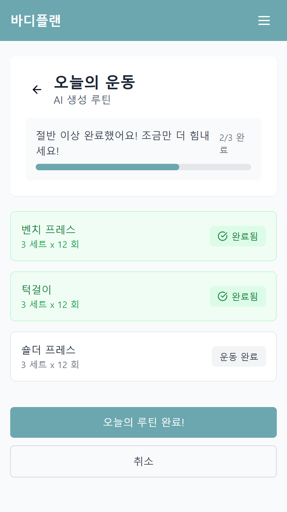

# 📌 개요
프로젝트명: 바디플랜 

기능: ai를 통한 운동루틴생성 및 기록&관리

## 주소

배포 링크: [https://new-project2-one.vercel.app/ ](https://new-project2-one.vercel.app/)  

## 미리보기

## 기술 스택

- **Frontend**: React, TypeScript, TailwindCSS, Vite
- **Backend**: Express, Node.js, MongoDB
- **AI**: OpenAI GPT API
- **배포**: Vercel (프론트), Render (백엔드), MongoDB Atlas
- **기타**: JWT, Axios, React Query

## 주요 기능

- 🔐 사용자 회원가입 및 로그인 
- 🤖 GPT API를 통한 운동 루틴 생성
- ✏️ 운동 루틴 편집 및 저장
- 📊 운동 히스토리 조회
- 🗨️ 댓글 작성

## 추후 개선할 사항
- 프로젝트 구조 개선
- 모듈화 

## 담당 역할
- 기획 / UI 설계 / 프론트엔드 / 백엔드 / 배포 전과정

## 기타
캡스톤용 플젝

